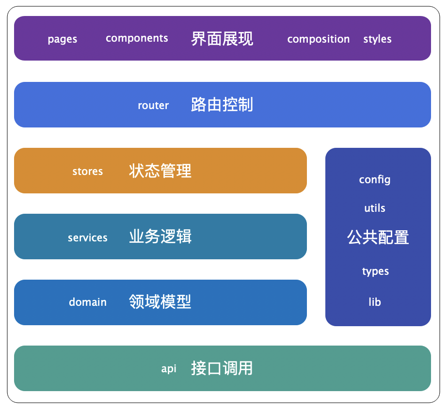
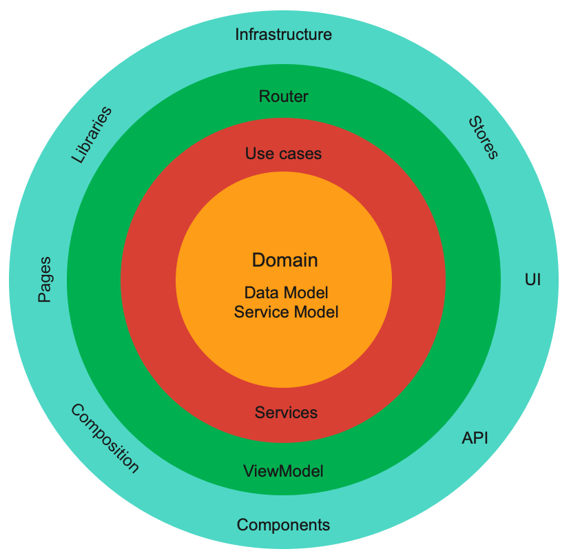
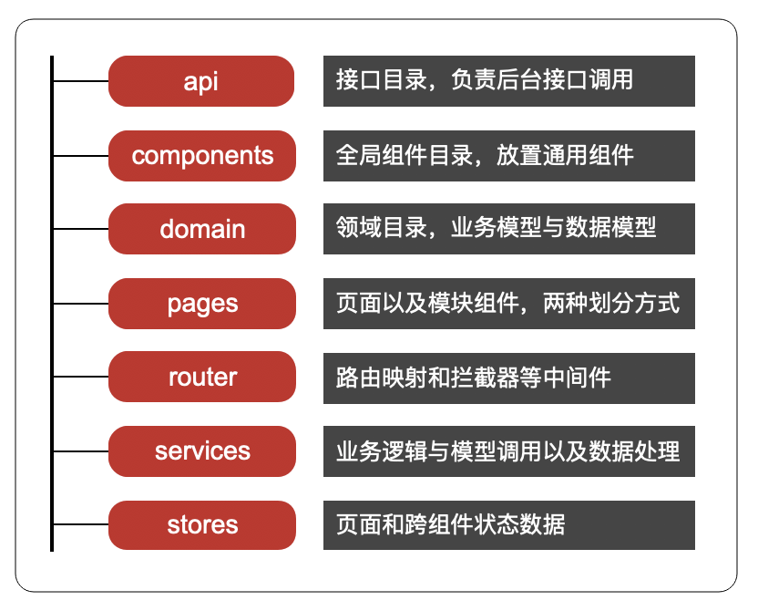

# Letjs设计思想白皮书

网址：[https://github.com/let-js](https://github.com/let-js)
author: Letjs开发组  &nbsp;&nbsp; 日期：2022-11
## Letjs是什么？
    Letjs是基于MVC和DDD等思想制定的一套前端工程结构模板，也是一套开发工程规范。

##  为什么要有Letjs？
    1. 前端框架眼花缭乱，大家不知道该如何选择框架和配套工具，初始化工程困难。
    2. 前端代码缺乏分层约束，书写随意，大型工程时间一久就变得不易维护，代码混乱不堪。
    3. 团队内部技术不统一，各种新技术和类库随意使用，项目不易维护和交接。

## Letjs工程结构思想

1. 基于[MVX分层设计思想](./img/mvc.png)，将视图和业务逻辑以及数据模型进行分层，从而让视图与业务数据解耦。这里将视图渲染和展现逻辑放在Component里，业务逻辑和数据处理则交由Service和Domain来处理。

2. 基于[DDD领域驱动设计](./img/ddd.png)，将业务模型分为前端展现数据模型和后端接口数据模型，统一整合在领域层。同时根据业务模型分为ServiceModel和DomainModel，DomainModel负责数据定义，ServiceModel负责业务流程组织。通过Domain领域建设，将使得业务按照功能聚类，从而向组件输出标准化业务能力。
    
3. 参考[AKF立方体实现组件化开发](./img/componentized.png)。为了实现业务隔离和代码复用，前端适合组件化开发思想，其中很重要的就是组件的分层和细化。AKF一种系统化拆分和扩展思路，我们将前端页面也按这个思路来进行水平和垂直拆解，以此实现可复用的组件化开发。其中水平以技术能力为维度分层，垂直则按照业务功能进行聚合。

## Letjs解决了什么问题？
    1. 组件内部分层、组件与业务逻辑解耦、业务逻辑与数据模型独立，让代码放在应该的位置上，避免代码混乱。
    2. 大型前端工程快速初始化，集成最新流行的前端框架和类库，生成工程目录结构，减少选择困难。
    3. 统一开发思想，提升认识，让前端开发更加规范化和系统化，让前端适合大型应用开发。

## Letjs适用哪些场景？
    1. 中大型后台系统，如OA、CMS、ERP等强业务流程系统等。
    2. 面向C端的大型网站，如商城、论坛社区、信息流等。
    3. 前端工具类，如在线word、图文与视频编辑器、电子邮箱等。

## Letjs工程结构说明

工程分层结构。根据以上指导思想，将项目按照界面展现和业务逻辑以及数据模型、接口等进行分层。

工程能力结构。将项目根据能力按照业务模型和数据模型进行领域分层划分，业务开发以领域模型为核心。

工程目录结构。主要目录结构如下图所示，详细结构请参加Letjs工程代码和例子。

## Letjs开发规范思想

作为一套工程结构规范，除了目录结构约束，还需要文件命名、函数命名规范以及相关配置约束等。
通过目录结构约束加上开发规范约束，才能更好地设计一个良好的系统架构来。

### 文件命名规范

#### api
    - 以模块或页面名+Api组成。Api只是接口集合，类似于配置，与模块名保持一致便于查找。

#### components
    - 首字母大写，根据功能按多个词组组成。组件按照习惯首字母大写，类似一个封装的对象。

#### composition
    - 以模块或公共功能命名。为页面和组件提供通用的组合函数。

#### domain
    - 按业务抽象，首字母大写。domian里面主要是各种Model和Modelservice，由Class组成。

#### pages
    - 页面跟路由对应，首字母大写。页面跟url对应便于查找，页面本身也是一个组件。

#### router
    - 集中管理，小写。通常1-2个文件即可，集中在一起，类似配置项。

#### services
    - 根据模块或页面命名。service负责接口调用和数据处理，是展示和数据模型承接层，故根据模块来命名，便于集中管理。

#### stores
    - 根据模块或页面命名，store与页面和组件紧密关联。

### 函数命名规范
    - 驼峰式小写，参照JS通用规范。
    - 从视图组件->容器组件->service->api 函数名称尽量保持一致，按照doSomeThing方式保持语义化。

### 路由规范
    - 路由配置拦截器中间件，在请求和响应时做通用拦截和过滤处理。
    - 路径与页面名称一一对应，便于查找。

### 组件规范
    - 遵循组件化开发思想，所有元素均组件化，组件本身尽量保持独立和可复用。
    - 组件分为容器组件和视图组件。
    - 视图组件负责视图渲染，含业务逻辑与UI组件调用，容器组件负责引入视图组件以及数据调用。
    - 复杂独立组件，单独放在lib目录或进行npm发包。

### 数据传递规范
    - 数据通过api获取，service进行传递和数据处理。
    - store主要用于存放页面和组件的公用或交换数据。
    - 容器组件以及composition跟service与store打交道，service跟api打交道。
    - 获取数据流程：视图组件->容器组件props->service(转domain)->api。
    - 提交数据流程：视图组件->容器组件props->service(转domain)->api。

### 数据处理规范
    - 组件按照自己需要对外开放数据配置。
    - service通过formatter进行统一数据处理，将原始数据转为数据Model。
    - 也可通过业务Model按内部业务逻辑处理数据Model。

### 日志规范
    - 采用内部useLogger工具。
    - service获取原始数据和处理过后均需要打印。
    - 页面和组件中可以配置打印数据。
    - 数据不合法时需要打印。
    - 所有调试数据上线后移除。

## 开发顺序建议
   1. 对于中大型工程，先了解整体需求，进行需求初评，知道整体业务流程和主要功能。
   2. 开始规划技术方案，确定技术选型，划分主要功能与模块。
   3. 按模块进行详细需求评审，包含UE与UI评审，确定页面具体功能与交互细节。
   4. 设计前后端交互接口，明确接口和字段，梳理业务逻辑与数据流程。
   5. 开始规划目录结构和文件，自外往里，根据业务功能将service、api、domain、页面等空文件建好。
   6. 明确各模块domain内里Model的属性和方法，完成数据模型设计。
   7. 模拟数据或调用接口，开发api，在service中调用和转换数据。
   8. 设计页面和组件，根据功能确定页面与组件关系，由外往里确定。
   9. 开发容器组件和视图组件，由内往外开发，并嵌入到页面。
   10. 最后进行前后端联调和功能集成验证。
