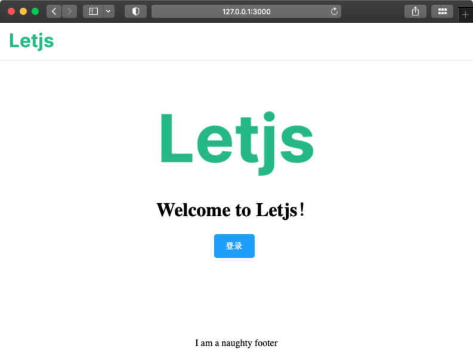

# Letjs前端工程化模板，助你快速搭建页面

## 前端开发需要工程化

  随着前端生态的繁荣发展，工具框架越来越多，让人眼花缭乱，目不暇接。那么多框架、类库、工具该如何选择呢？如何搭配才是最优组合？

  前端应用的代码规模也越来越大，如何组织代码是个难题。模块划分、目录结构、分层职责以及数据流程等都需要清晰明了，否则随着时间积累代码就变得不可维护。那代码该如何组织呢？或者前端工程化应该怎么做呢？

  **Letjs团队开发了前端工程化体系，定义了一套目录结构和分层体系，通过工具命令一键创建代码模板，专门解决前端工程化问题。**

## Letjs是什么？
  Letjs是一套前端工程化开发体系，通过内置UI库和各种工具，帮助你快速创建前端工程代码，同时让你的代码更清晰简单、易于维护。

## Letjs能做什么？

  Letjs就是来帮助前端开发更加体系化的，让前端更加清晰、简单、高效。

  1. 帮助代码初始化。前端框架眼花缭乱，代码初始化选择是个难题，这需要很多的经验。Letjs帮你选择框架与类库。

  2. 帮助代码分层。代码缺乏分层约束，书写随意，时间一久就变得不易维护，代码混乱不堪。Letjs帮你组织代码。

  3. 增强规范和提升效率。团队内部技术不统一，各种新技术和类库随意使用，项目不易维护和交接，且效率低下。Letjs提供工具来帮助统一结构，并用工具来初始化代码，提升开发效率。

## Letjs工程目录结构
  将代码按照展现、业务处理、接口等进行分层，并根据领域模型划分数据模型和视图模型等，业务开发围绕以领域为核心。

  

  工程目录结构如下图所示，详细结构请参加Letjs工程代码和例子。

  

## Letjs下载与使用
  如果您要使用letjs结构进行项目开发，请安装 `letjs-cli` 工具。  详见：[letjs-cli安装指导](https://let-js.github.io/guide/#%E5%AE%89%E8%A3%85-letjs-cli)
  
  ### cli安装
  `$ npm install -g @let-js/letjs-cli`

  ### 初始化工程
  `letjs init demo-app`

  ### 运行代码
  `npm install`
  
  `npm run dev`

  ## 查看效果
  

###  Letjs站点与源码
站点：[https://let-js.github.io](https://let-js.github.io)
源码：[https://github.com/let-js](https://github.com/let-js)

## 设计思想白皮书
[设计思想白皮书PDF](https://github.com/let-js/docs/blob/main/letjs-whitepaper.pdf) 

## 联系方式
欢迎扫码加群，一起探讨前端工程化：

或者添加账号：springbuild 或 Elvin_wyf